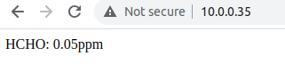

# Formaldehyde-Meter
Home Made Formaldehyde (HCHO) Meter for Your New House/Office


# Hardware

- [X] DFRobot Gravity: HCHO Sensor ([69.61 CAD on Digikey](https://www.digikey.ca/en/products/detail/dfrobot/SEN0231/7087195))
- [X] Arduino MKR WiFi 1010 ([47~69 CAD on Amazon](https://www.amazon.ca/Arduino-MKR-WiFi-1010-ABX00023/dp/B07FYFF5YZ))

# Software

Update your wifi name and password at the following lines:

```
char ssid[] = "";             //  your network SSID (name) between the " "
char pass[] = "";      // your network password between the " "
```

Burn the [code.ino](code.ino) into the Arduino board and then it will keep sending the HCHO value to it's local IP port 80:


